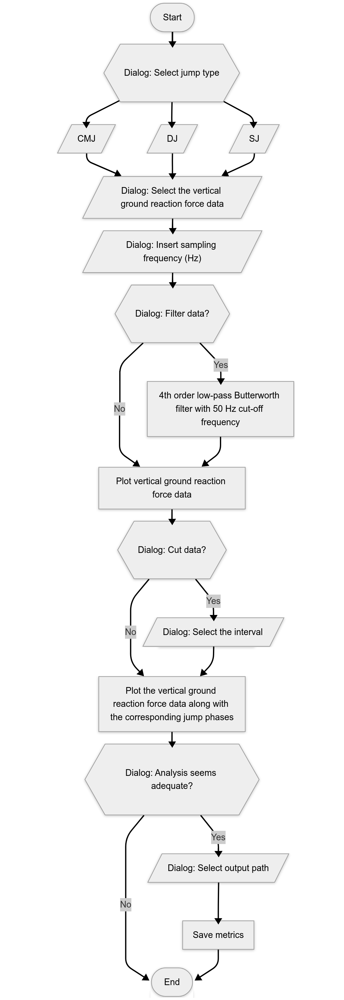

The scripts were designed to analyze data in txt format. Given the range of ground reaction force output provided by the force platforms, which can vary from one- to three-dimensional motion systems and single or dual systems, a simpler input model was selected to cover as many devices as possible. Consequently, the expected format for single systems is a single column containing the vertical ground reaction force data (Fz; in Newtons), with rows containing a non-numeric character being ignored during data processing. For dual systems, two Fz-columns are expected.

When the script is executed, a dialog box prompts the user to select the type of jump to be analyzed, followed by the selection of the verical jump (VJ) Fz-data file. Subsequently, another dialog box prompts the user to insert the sampling frequency of the data in Hz. The user is then given the option of filtering the data. A plot of the VJ-Fz is then presented, and a cutting option is provided to reduce preprocessing demands in cases where the window includes data irrelevant to the analysis. Following this, an additional plot of the VJ is displayed, illustrating its respective phases. The user is subsequently presented with the option to select a destination path to save the metrics (saved in a tab-separated txt file).

  

The scripts were converted into executable file using PyInstaller, a tool for creating standalone Python applications, and its executable version can be downloaded at [Zenodo](https://doi.org/10.5281/zenodo.17167260). The command “pyinstaller --onefile -w” was used to package the script and its dependencies into a single executable file. The interface is interactive, enabling navigation through the use of mouse clicks and by the “Enter” key to proceed and the “Esc” key to cancel. In the event of a processing error, the phase during which the error occurred is reported, and the script is closed.
