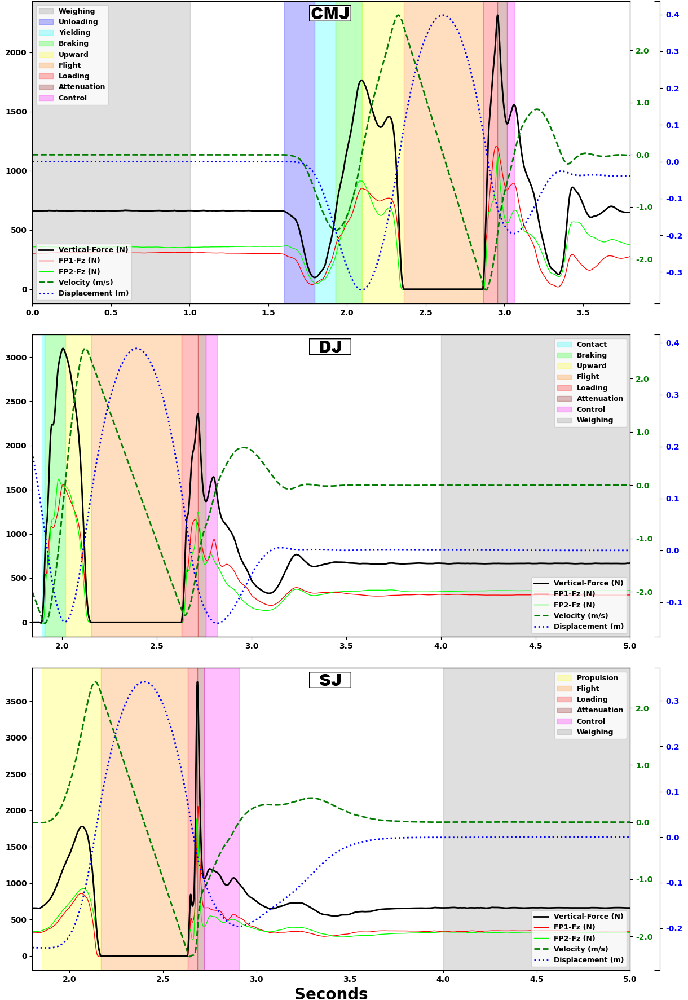

# 1. Summary

This paper presents an open-access Python script with user-friendly executable files designed to operate independently of any integrated development environment. The script aims to reduce financial barriers and facilitate the analysis of ground reaction forces for the most common vertical jump (VJ) types in the scientific literature (i.e., countermovement jump, squat jump, and drop jump) using single or dual force platform systems.

# 2. Statement of need

VJs performed on force platforms yield a range of metrics for assessing the lower limbs’ function [@Bishop:2023] and the kinetic data obtained can be used to estimate kinematic metrics by tracking participant’s center of mass displacement (CoM-D). The derived metrics allow for the investigation of strategies to improve performance [@Krzyszkowski:2022; @McLellan:2011] and to identify injury risk [@Jordan:2015; @Pedley:2020]. However, uncertainty may arise in the analytical approach, particularly due to the heterogeneity in the definitions of VJ phases [@Harry:2020; @McMahon:2018; @VanHooren:2017] and the appropriate calculation of the metrics [@Bishop:2023; @Bishop:2022].

Different options are available for calculating VJ metrics, including analysis in Excel [@Chavda:2018; @Delgado-García:2025], MATLAB [@Harry:2021; @Merrigan:2022], and Python [@Smith:2024]. Notably, the study by [@Merrigan:2022] provided scripts to analyze the countermovement jump (CMJ), drop jump (DJ), and squat jump (SJ). However, because the scripts are written in MATLAB, purchasing the software may be a financial barrier. Additionally, bilateral asymmetry analysis performed on dual force platform systems are not supported. These limitations were mitigated by [@Delgado-García:2025], who provided an open-access method that include asymmetry analysis, but only for CMJ. Furthermore, none of the previous studies included metrics related to the landing phases of these VJs.

# 3. Data Processing Methods

### 3.1 Time List and Weighing

The time is calculated based on the sampling frequency. During the vertical ground rection force (Fz; in Newtons) data processing, each row is counted from top to bottom and divided by the inserted sampling frequency, thereby resulting in the time list (seconds). Afterwards, the participant’s weight (N) is calculated. The initial second of the Fz-data is used as a reference for the CMJ, while the final second is employed for both the DJ and SJ. The mean Fz during these one-second intervals is considered the participant’s weight [@Chavda:2018; @McMahon:2018; @Owen:2014]. Therefore, it is important to instruct the participant to remain stable for at least one second prior to the CMJ initiation and one second post DJ and SJ landing [@Wank:2019].

### 3.2 Integration Methods

In contrast to the CMJ, where the conditions are ideal for initiating the integrations relative to the standing position (i.e., the CoM vertical position is 0 m, and the velocity is 0 m * s^-1^), the DJ and SJ do not initiate under these conditions. These conditions are satisfied at the end of the jump, once the subject returns to and remains in the standing position. As a result, the weighing phase is performed at the end of both DJ and SJ. Therefore, for the CMJ the traditional integration method was employed, while the backward integration method was utilized for the DJ and SJ [@Grozier:2021; @Wade:2022; @Wank:2019].

Based on Newton’s second law, the kinetic Fz-data of the force platforms were used to estimate kinematic metrics by CoM-D throughout the VJs:

*1^st^ step:* The participant’s weight is subtracted from each data point in the Fz-list, resulting in the net-Fz-list (N);

*2^nd^ step:* The mean of each pair of consecutive intervals in the net-Fz-list is calculated and multiplied by the time interval, resulting in the net-impulse-list (N * s);

$$
Impulse = \frac{F_{z_i} + F_{z_{i-1}}}{2}\,\Delta t
$$

*3^rd^ step:* The participant’s weight is converted to mass by dividing it by gravitational acceleration (9.807 m * s^-2^). Each data point in the net-Fz-list is then divided by mass, yielding the acceleration-list (m * s^-2^);

*4^th^ step:* The first integration is calculated using the trapezoidal rule, initializing the velocity-list (m * s^-1^) with zero up to 30 ms before the VJ-start to mitigate integration drifts [@Owen:2014]. Velocity at each time interval is calculated by adding the product of acceleration along the time:

$$
v = \sum \frac{(a_i + a_{i-1})}{2} \Delta t
$$

*5^th^ step:* The second integration is calculated using the trapezoidal rule, where the CoM-D (m) at each time interval is calculated by adding the product of velocity along the time:

$$
\text{Displacement} = \sum \frac{v_i + v_{i-1}}{2} \Delta t
$$

*6^th^ step:* Fz-list values are multiplied by the velocity at each time point, resulting in the power list (W).

### 3.3 Jump Start, Takeoff and Landing Detections

The method proposed by [@Owen:2014] was used to establish the CMJ- and SJ-start. The Fz standard deviation (SD) was calculated during the weighing phase, and the start was defined as an alteration in participant’s weight ± 5 SD. In the DJ, an Fz value > 20 N was initially defined as the start [@Harry et al., 2020].

Analogous to DJ-start detection, the takeoff was delineated as the initial point in the Fz-list where the value was < 20 N, and the landing was the first value after the takeoff > 20 N [@Harry:2020]. Subsequent to the identification of the aforementioned points, a 30 ms period from takeoff was delineated, as well as a 30 ms period prior to landing, the remaining interval only accounts for Fz during flight (unloaded force platform) to identify the signal noise. Previously reported approaches established an arbitrary period of 300 ms for identifying force platform noise [@Chavda:2018]. We choose to take the maximum value within the flight of each VJ to measure noise. This approach was adopted due to the potential inability of injured populations or single-legged jumps to remain in the air for 300 ms. Subsequent to the establishment of the maximum noise, a new search was conducted. The first value lower than maximum force platform noise was used to define the actual takeoff. The same procedure was repeated for landing and DJ-start, where a search in the period prior to the Fz value > 20 N sought the first value greater than maximum force platform noise. 

Following the delineation of the takeoff-landing, all the Fz values within this interval were set to zero to mitigate integration drifts [@Eythorsdottir:2024].

### 3.4 Jump Phases Definition

The phases preceding CMJ takeoff were defined based on the approach delineated by [@Harry:2020], while the terminology was adapted to “upward” and “downward” rather than “concentric” and “eccentric” [@VanHooren:2017]. The DJ-phases were adapted based on the study by [@Harry:2020], removing the unloading and yielding from the downward phase. The SJ-propulsion was divided into two phases according to the study by [@Jordan:2015]. Phase 1 refers to the interval between SJ-start and half of total propulsion-phase, and Phase 2 refers to half of total propulsion-phase and takeoff interval. The entire SJ-propulsion was also considered as a single phase [@Jordan:2015]. The landing phases were defined in a standard manner for all VJs, as outlined in the study by [@Harry:2022b].

**Table 1.** Methods used to define the phases in each vertical jump.

| Phase             | Jump  | Phase-Start                        | Phase-End                                                                 |
|-------------------|-------|-----------------------------------|---------------------------------------------------------------------------|
| Weighing          | CMJ   | Initial Fz point                   | Point equivalent to Fz sampling frequency (one second) counting from the initial point (backwards in SJ and DJ) |
|                   | DJ    | Final Fz point                     |                                                                           |
|                   | SJ    |                                   |                                                                           |
| Unloading         | CMJ   | Alteration in weight ± 5 SD        | *Minimum (Min) Fz                                                         |
| Yielding Contact   | CMJ   | *Min-Fz                            | *Min-CoM velocity                                                         |
|                   | DJ    | Weight > Maximum (Max) noise       |                                                                           |
| Braking           | CMJ   | *Min-CoM velocity                  | *CoM velocity > 0 m·s⁻¹                                                   |
|                   | DJ    |                                   |                                                                           |
| Upward            | CMJ   | *CoM velocity > 0 m·s⁻¹            | Fz < Max-noise                                                            |
|                   | DJ    |                                   |                                                                           |
| Propulsion Phase 1 | SJ    | Alteration in weight ± 5 SD        | ½ of total propulsion phase                                               |
| Propulsion Phase 2 | SJ    | ½ of total propulsion phase        | Fz < Max-noise                                                            |
| Flight            | CMJ   | Fz < Max-noise                     | Fz > Max-noise                                                            |
|                   | DJ    |                                   |                                                                           |
|                   | SJ    |                                   |                                                                           |
| Loading           | CMJ   | Fz > Max-noise                     | Peak landing Fz                                                           |
|                   | DJ    |                                   |                                                                           |
|                   | SJ    |                                   |                                                                           |
| Attenuation       | CMJ   | Peak landing Fz                    | Local Min-landing-Fz (i.e., the 1st valley after peak landing Fz)         |
|                   | DJ    |                                   |                                                                           |
|                   | SJ    |                                   |                                                                           |
| Control           | CMJ   | Local Min-landing-Fz               | CoM velocity > 0 m·s⁻¹                                                    |
|                   | DJ    |                                   |                                                                           |
|                   | SJ    |                                   |                                                                           |

*Countermovement Jump (CMJ); Drop jump (DJ); Squat jump (SJ); Standard deviation (SD); Center of mass (CoM).  
\*In the interval prior to the flight phase.*

Figure 1 illustrates the VJ phases obtained from the script (from dual force platform analysis; the only difference to the single force platform being the individual representation of each Fz curve).

### 3.5 Individual Metrics for Asymmetry Calculation

To calculate the asymmetries in dual force platforms systems, the phases were first defined based on the total Fz; the sum of both force platforms with simultaneous phase detection for both limbs [@Janicijevic:2022]. In the impulse calculations, the net-Fz-list was derived based on half of the participant’s weight [@Benjanuvatra:2013]. The data across the VJ-phases (mean and peak Fz; and impulse) are presented individually for each force platform, allowing for different approaches to calculating asymmetries.

# 4. Availability

The code is available on [Zenodo](https://doi.org/10.5281/zenodo.17167260). The tool is distributed under the MIT License, allowing for free use, modification, and redistribution. For further details on metric calculations and interactive interface development, refer to the script comments. Instructions for usage are provided in the README file.

# 5. Acknowledgements

The author LGM would like to thank CNPq – Conselho Nacional de Desenvolvimento Científico e Tecnológico for the scholarship, as well as Felipe Gidiel-Machado and Germano Buzzato de Souza for helping in the development of the scripts presented in this study through their discussions.

# 6. References
